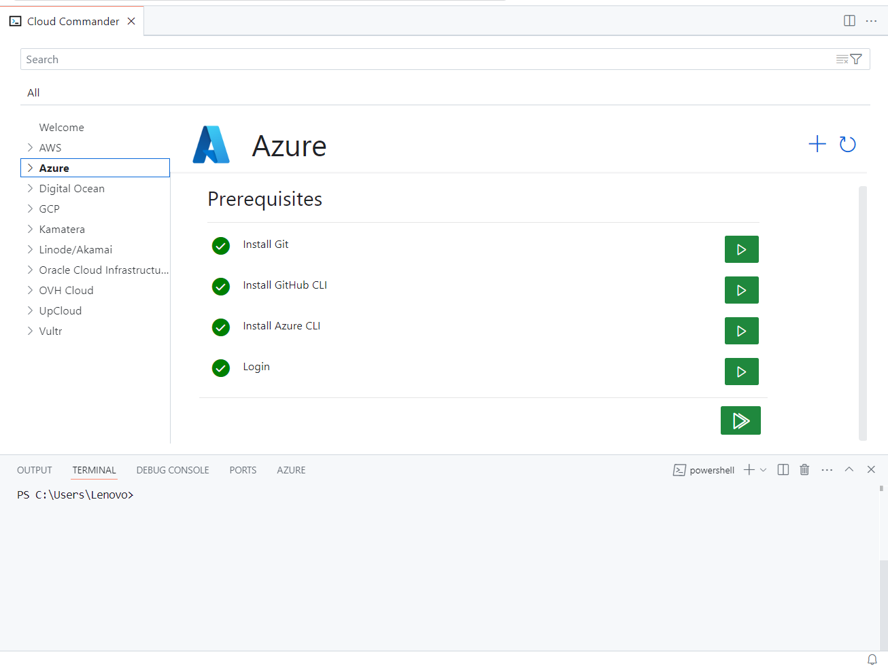
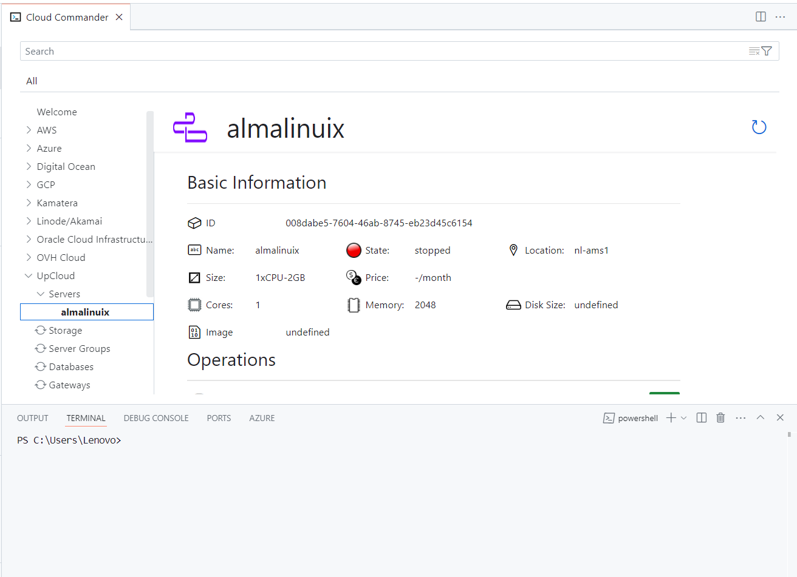

# SmarterCode Cloud Commander

Cloud Commander is an extension providing consistent UI over multiple infracture providers CLIs.

Follow this link for complet [Cloud Commander Documentation](https://zikalino.substack.com/p/cloud-commander-for-visual-studio?r=4ekvcx&utm_campaign=post&utm_medium=web&triedRedirect=true)

Currently the support is already available for following providers:

- Azure
- Digital Ocean
- Linode
- UpCloud

Extension will provide following functionality:

- Setting up tools for selected infrastructure providers
- Help to login / setup credentials
- Browse all resources
- Compare resource pricing

## Setting Up Prerequisites

## Browsing Resources

## Creating VMs

